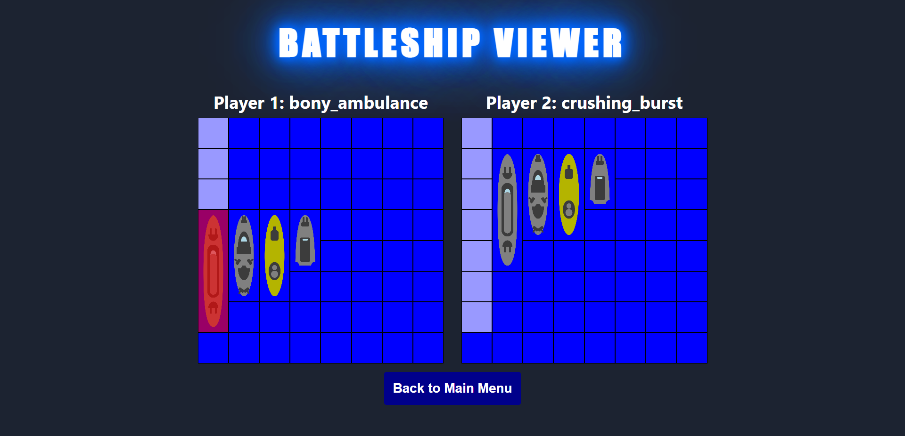

# Introduction

This project allows players to play Battleship against an AI in single player mode or against other players in multiplayer mode. Users can play the game through a UI on a touch screen display connected to the DE1-SoC. When playing against other players, the user must be connected to the internet through Wifi so that communication can be established with the server that is hosted on the cloud. When playing against the game AI, the user can simply start a game locally on the DE1 itself without an internet connection. A web application is also served by the server, and this allows players to view multiplayer games that are in progress.

A video demo of the project can be found on [YouTube](https://youtu.be/wNQSp-0DwI0).

# System Description

The DE1-SoC is connected to the touch screen and wifi controller. The touch screen has a UI to start/stop a game, place battleships, and fire at their opponent. When playing against another player, relevant player actions are sent to a node.js cloud server hosted on an AWS EC2 instance. The server allows players to create and/or join a game room to implement the multi-player functionality. When playing in the single-player mode, the user plays against a game AI implemented in software that is run on the DE1. The diagram below shows how components communicate with each other.

# Accomplishments

## Cloud Component

### Server

All core features are supported by the server, as well as some nice-to-haves. The list of all implemented user features is as follows:

- Clients are assigned a random username (adjective + noun) and can change this username, if desired.
- Clients can create a new game that is either public (people can be randomly assigned to the game) or private (users can ONLY join the game through the game code). A unique, randomly generated game code is created for each game.
- Clients can join a game either randomly (if it is public) or by specifying its game code.
- Clients can leave a game at any time.
- Games that are empty are automatically removed to free up space for new games.
- Players can set up their ships in a game, fire at their opponent, and/or reset a game (if it ended).
- Players receive game updates (e.g. opponent left the game, opponent set up their ships, opponent fired at them, game is over).
- Clients can spectate games that they are not playing in. This allows them to received game updates and gives them access to information that needs to be hidden from players.
- Websocket messages are always validated by the server to ensure that required data is included and that only valid game moves are processed (e.g. players can only fire on their turn, ships must not overlap, etc.).

### Web Application

All core features are supported by the web application, as well as some nice-to-haves. The list of all implemented user features is as follows:

- Users are able to select a game to watch through the menu page. This game can be specified by its game code or randomly selected by the server.
- Users can view games in real time on the game page, which displays the current state of the game boards.
- Sound effects and a description of each move accompanies every relevant game update (i.e. successful shots and game over) in the game page.
- Users can easily navigate to/from any page at any time.

Below are a few pictures of the game UI.

## User Component

### Touchscreen Controller and VGA

The touchscreen controller and VGA are connected to the NIOS II processor. The touchscreen controller is used to detect when the user touches the screen and to send the x,y coordinates of the touch to the NIOS II processor using UART. The VGA is used to display the UI on the screen.

All core features are supported by the touchscreen UI and backend logic used to control the UI. The list of all implemented user features is as follows:

- Selecting between single and multiplayer game modes
- Creating/Joining a multiplayer game using an auto-generated code
- Placing ships on the game board and firing at the opponent's board
- Validating that ships are placed correctly and that shots are fired at valid locations
- Displaying the current state of both the user's and opponent's boards
- Displaying messages/instructions to improve the user experience
- Ability to update the game state and display changes on the UI upon feedback from the server (using wifi) and the AI (in single player mode)

## Hardware Component

### Wifi

### Game AI

### Speaker

# Authorship

- Mark Mekhail
- Ritam Singal
- Ryan Clayton
